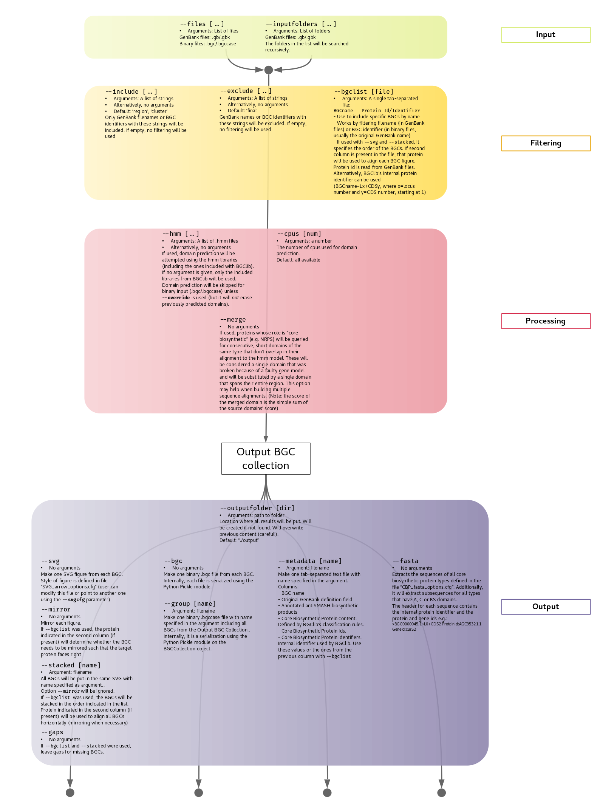
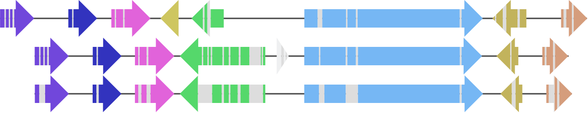

# BGC lib

This is the official repository of the **Biosynthetic Gene Cluster Library**, a Python library with classes and methods that facilitates manipulation and analysis of BGCs. It is currently focused on fungal BGCs.

For more information on BGClib, see [here](./BGClib/Readme.md).

:warning: This code is under heavy development!

# BGC Toolkit

This companion script harnesses the capabilities of BGClib to ease the processing of certain BGC data.

## Features overview

* GenBank and binary [^1] input 
* Input filters (default values tailored for antiSMASH output)
* Domain prediction with the possibility of combining several hmm libraries.
* Classify (fungal) core biosynthetic proteins. Distinguish between reducing and non-reducing PKS, NRPS/PKS and PKS/NRPS hybrids etc. (uses included hmm models, mostly from Pfam)
* High quality SVG figures (see examples below)
* Extract amino acid sequences of core biosynthetic proteins (and subsequences of A, C and KS domains)
* Save as binary files [^1]

[^1]: Currently uses Python's Pickle module for serialization of `BGC` or `BGCCollection` objects from BGClib

## BGC Toolkit usage diagram



### SVG examples

Here is a simple example with the cladofulvin BGC:

```
./BGCtoolkit.py --files ./examples/data/cladofulvin/Cladofulvin_Final.gbk --outputfolder examples/output/cladofulvin --include --svg
```

It has been renamed from a fungiSMASH result, so it doesn't include the usual 'region' string and we have to disable that filter by using `--include` without arguments. This command will produce


If you open the SVG alone in a new tab, you'll see that putting your cursor on top of the arrows will display the Protein Id and the internal identifier.

The PKS is in the reverse strand, but we can mirror the image with `--mirror`:

```
./BGCtoolkit.py --files ./examples/data/cladofulvin/Cladofulvin_Final.gbk --outputfolder examples/output/cladofulvin --include --svg --mirror
```


The color mode in the default styling parameter file ([SVG_arrow_options](./SVG_arrow_options.cfg)) has been changed to `random-pastel`.

Now we'll use some BGCs from [MIBiG](https://mibig.secondarymetabolites.org/).

First, an example with a multi-locus GenBank file, sophorolipid (`color_mode=white`), from MIBiG 1.4 (currently not in MIBiG 2.0):

```
./BGCtoolkit.py --files ./examples/data/sophorolipid/BGC0001274.1.gbk --outputfolder examples/output/sophorolipid --include --svg
```


Now for a more interesting example, we'll stack the three BGCs encoding cercosporin (BGC001247 from MIBiG 1.4 and BGC0001541 and BGC0001542 from MIBiG 2.0):

```
./BGCtoolkit.py --inputfolder ./examples/data/cercosporin/ --outputfolder examples/output/cercosporin/ --include --svg --stacked stacked_BGC_figure
```


It's a bit messy but we can define an order and align according to a specific gene (by providing their corresponding Protein Id). For this we'll use a file like [this one](examples/data/cercosporin/cercosporin_MIBiG.tsv). BGCs will be mirrored as needed:

```
./BGCtoolkit.py --inputfolder ./examples/data/cercosporin/ --outputfolder examples/output/cercosporin/ --include --svg --bgclist ./examples/data/cercosporin/cercosporin_MIBiG.tsv --stacked cercosporin_MIBiG
```


Neat.

Finally, let's use three mycophenolic acid BGCs from MIBiG 2.0 with domain annotation (using version 33 of [Pfam](https://pfam.xfam.org/)):

```
./BGCtoolkit.py --inputfolder ./examples/data/mycophenolic\ acid/ --outputfolder examples/output/mycophenolic\ acid/ --include --svg --bgclist ./examples/data/mycophenolic\ acid/mycophenolic_acid_MIBiG.tsv --stacked mycophenolic_acid_MIBiG --hmm ~/Databases/pfam/33/Pfam-A.hmm
```


There is some questionable gene calling going on.

Now with an alternative alignment to the genes encoding proteins containing domain DUF2236. We'll use a different file

```
./BGCtoolkit.py --inputfolder ./examples/data/mycophenolic\ acid/ --outputfolder examples/output/mycophenolic\ acid/ --include --svg --bgclist ./examples/data/mycophenolic\ acid/mycophenolic_acid_MIBiG_DUF2236.tsv --stacked mycophenolic_acid_MIBiG_DUF2236 --hmm ~/Databases/pfam/33/Pfam-A.hmm
```


Domain colors are already defined (originally generated randomly) but you can change them [here](BGClib/data/domain_color_file_ID.tsv).

Playing with the style file, `color_mode=domains` + `outline=False` will produce:



where the color of the arrows takes the color of the first domain (core biosynthetic genes will have their own pre-defined colors). Some of these options are experimental and will probably change in the future.


# Requirements

Installation of the required libraries to make BGClib work through (mini)conda is recommended. Here's a list of what you'll need. Version in parenthesis is the one that is known to work, but newer versions should work as well.

* biopython (1.76)
* hmmer (3.3)
* lxml (4.5.0)
