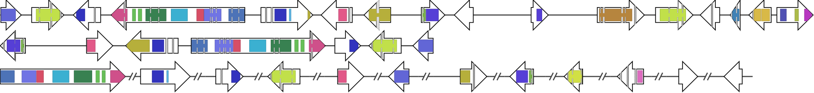
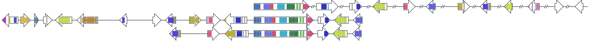
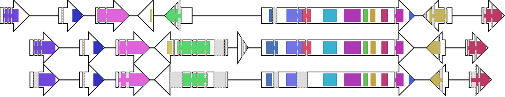
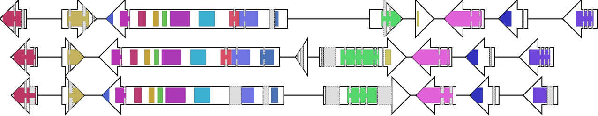

# BGC lib

This is the official repository of the **Biosynthetic Gene Cluster Library**, a Python library with classes and methods that facilitates manipulation and analysis of BGCs.

For more information on BGClib, see [here](./BGClib/Readme.md).

:warning: This code is under heavy development!

As an application of what it can do, two companion scripts are included:

# BGC SVG generator

This script will generate high-quality figures from GenBank files. It is not limited to biosynthetic gene clusters.

## Features

* Input: GenBank or .bgc/.bgccase files (see [here](#bgc_toolkit)). GenBank files (.gb/.gbk) must have the protein translation.
* Data filters: There are three types of filters
  - Include strings. Only filenames (or BGC identifiers, in the case of .bgc/.bgccase files) with these strings will be included. Default: 'region', 'cluster'.
  - Exclude strings. Filenames or identifiers with this string(s) will be ignored. Default: 'final'. 
  
  The default values for these two filters ensure that results from antiSMASH (v4, v5) will not include the whole genome.
  
  - BGC list. A tab-separated text file. First column: cluster/identifier name. Second (optional) column: Protein Id. This file can be used to 1) further filter the input data, 2) define an order (in case all BGCs are included in a single figure) and 3) to align.
  
* There are some options to change the styling of the figure through an external configuration file.
* Figures can be produced individually or in a single SVG.
* Additionally, the genes can be decorated by drawing regions inside them that depict domains in their coresponding translations. 

## The whole options

```
Input:
  -i INPUTFOLDERS [INPUTFOLDERS ...], --inputfolders INPUTFOLDERS [INPUTFOLDERS ...]
                        Folder(s) to look for .gb and .gbk files (note: output folder will not preserve the structure of input folders).
  -f FILES [FILES ...], --files FILES [FILES ...]
                        File(s) used to draw the figures (accepted: .gb .gbk, .bgc, .bgccase). Note: for .bgc and .bgccase files, inclusion rules by --include, --exclude and --bgclist will be applied to the internal BGC identifier, not the name of the file
  --hmm HMM [HMM ...]   Location of .hmm file(s). This will also enable internal hmm models. Note that if the SVG style options have 'draw_domains=False', no domain prediction will be made, even if .hmm files are specified
  -l BGCLIST, --bgclist BGCLIST
                        A file containing a list of BGC identifiers (i.e. filename without .gb or .gbk extension). If specified, use it to filter all the BGCs found with --inputfolders or --files. If --stacked is used, this list will determine the order (and
                        filename). An optional second column (separated by a tab) with the Protein ID can be specified. If this column is present, the BGC will be mirrored if needed such that the gene encoding the Protein ID in the second column is in the forward
                        strand. Additionally, if --stacked is used and all Protein IDs are present, the corresponding gene will also be used for horizontal alignment. Any extra columns or rows starting with the '#' character will be ignored. The BGC identifiers in
                        this file are treated case-sensitive.
  --include [INCLUDE [INCLUDE ...]]
                        Specify string(s) to filter which BGCs will be accepted. In the case of .gb or .gbk files, the filter is applied to the filename. For data stored as .bgc or .bgccase files, the filter is applied to the BGC(s) identifier. If the argument is
                        present but no parameters are given, the filter will be ignored. If the argument is not present, the default is to use the strings 'region' and 'cluster')
  --exclude [EXCLUDE [EXCLUDE ...]]
                        Specify string(s) to filter which BGCs will be rejected. Similar rules are applied as with --include. If the argument is not present, the default is to use 'final'.

Processing options:
  --cfg CFG             Configuration file with SVG style. Default: 'SVG_arrow_options.cfg'
  -m, --mirror          Toggle to mirror each BGC figure. Ignored with --stacked or --bgclist
  --override            Use domain prediction in .bgc and .bgccase files, even if they already contain domain data (does not overwrite input files).
  -c CPUS, --cpus CPUS  Number of CPUs used for domain prdiction. Default: all available

Output:
  -o OUTPUTFOLDER, --outputfolder OUTPUTFOLDER
                        Folder where results will be put (default='output')
  -s, --stacked         If used, all BGCs will be put in the same figure. Default: each BGC has its own SVG.
  -g, --gaps            If --stacked is used, toggle this option to leave gaps when a particular BGC is not found in the input data
```

## Examples

Here is a simple example with the cladofulvin BGC:

```
./BGC_SVG_generator.py --files ./examples/data/cladofulvin/Cladofulvin_Final.gbk --outputfolder examples/output/cladofulvin --include
```

It has been renamed from a fungiSMASH result, so it doesn't include the usual 'region' string and we have to disable that filter by using `--include` without arguments. This command will produce


If you open the SVG in another window, you'll see that putting your cursor on top of the arrows will display the Protein Id and the internal identifier.

The PKS is in the reverse strand, but we can mirror the image with `--mirror`:

```
./BGC_SVG_generator.py --files ./examples/data/cladofulvin/Cladofulvin_Final.gbk --outputfolder examples/output/cladofulvin --include --mirror
```


The color mode in the default styling parameter file ([SVG_arrow_options](./SVG_arrow_options.cfg)) has been changed to `random-pastel`, that is why the colors are different.

Another example with a multi-locus GenBank file, sophorolipid (`color_mode=white`), from MIBiG 1.4 (currently not in MIBiG 2.0):

```
./BGC_SVG_generator.py --files ./examples/data/sophorolipid/BGC0001274.1.gbk --outputfolder examples/output/sophorolipid --include
```


Now for a more interesting example, we'll stack the three BGCs encoding cercosporin (BGC001247 from MIBiG 1.4 and BGC0001541 and BGC0001542 from MIBiG 2.0):

```
./BGC_SVG_generator.py --inputfolder ./examples/data/cercosporin/ --outputfolder examples/output/cercosporin/ --include --stacked
```



It's a bit messy but we can define an order and align according to a specific gene (by providing their corresponding Protein Id). For this we'll use a file like [this one](examples/data/cercosporin/cercosporin_MIBiG.tsv):

```
./BGC_SVG_generator.py --inputfolder ./examples/data/cercosporin/ --outputfolder examples/output/cercosporin/ --include --bgclist ./examples/data/cercosporin/cercosporin_MIBiG.tsv --stacked
```



Neat.

Finally, let's use three mycophenolic acid BGCs from MIBiG 2.0 with domain annotation (using version 33 of Pfam):

```
./BGC_SVG_generator.py --inputfolder ./examples/data/mycophenolic\ acid/ --outputfolder examples/output/mycophenolic\ acid/ --include --bgclist ./examples/data/mycophenolic\ acid/mycophenolic_acid_MIBiG.tsv --stacked --hmm ~/Databases/pfam/33/Pfam-A.hmm
```



There is some questionable gene calling going on.

Now with an alternative alignment to the genes encoding proteins with domain DUF2236 using a different file

```
./BGC_SVG_generator.py --inputfolder ./examples/data/mycophenolic\ acid/ --outputfolder examples/output/mycophenolic\ acid/ --include --bgclist ./examples/data/mycophenolic\ acid/mycophenolic_acid_MIBiG_DUF2236.tsv --stacked --hmm ~/Databases/pfam/33/Pfam-A.hmm
```



Domain colors are [already defined](BGClib/data/domain_color_file_ID.tsv) and were generated randomly

# BGC Toolkit

TODO

# Requirements

Installation of the required libraries to make BGClib work through (mini)conda is recommended. Here's a list of what you'll need. Version in parenthesis is the one that is known to work, but newer versions should work as well.

* biopython (1.76)
* hmmer (3.3)
* lxml (4.5.0)
